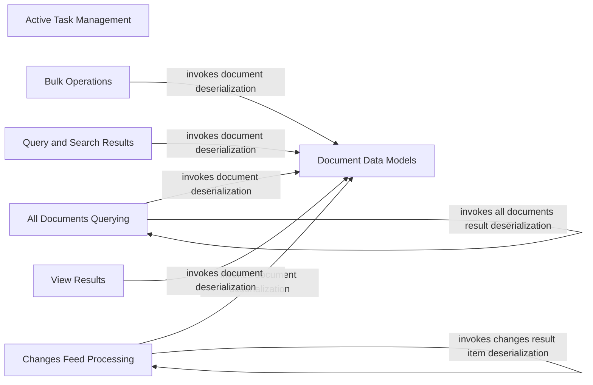

## Component Details

This graph represents the API Data Models subsystem, which is crucial for defining the structure of data exchanged with the Cloudant API. Its main purpose is to facilitate the serialization of Python objects to JSON for requests and the deserialization of JSON responses into Python objects, ensuring seamless data communication with the Cloudant database. The subsystem is composed of several specialized components, each handling specific data models and their associated operations, such as document management, active task representation, querying results, and bulk operations.

### Document Data Models
This component defines the fundamental Document data structure and provides methods for its serialization and deserialization, serving as a base for other document-related operations.

**Related Classes/Methods**:

- `ibmcloudant.cloudant_v1.Document` (full file reference)
- `ibmcloudant.cloudant_v1.Document:from_dict` (full file reference)
- `ibmcloudant.cloudant_v1.Document:_from_dict` (full file reference)
- `ibmcloudant.cloudant_v1.Document:_to_dict` (full file reference)
- `ibmcloudant.cloudant_v1.Document:__str__` (full file reference)
- `ibmcloudant.cloudant_v1.Attachment.from_dict` (full file reference)
- `ibmcloudant.cloudant_v1.Revisions.from_dict` (full file reference)
- `ibmcloudant.cloudant_v1.DocumentRevisionStatus.from_dict` (full file reference)

### Active Task Management
This component is responsible for managing and representing active tasks within the Cloudant database, including methods for converting task data from dictionary formats.

**Related Classes/Methods**:

- `ibmcloudant.cloudant_v1.ActiveTask` (full file reference)
- `ibmcloudant.cloudant_v1.ActiveTask:from_dict` (full file reference)
- `ibmcloudant.cloudant_v1.ActiveTask:_from_dict` (full file reference)
- `ibmcloudant.cloudant_v1.ActiveTask:_to_dict` (full file reference)
- `ibmcloudant.cloudant_v1.ActiveTask:__str__` (full file reference)

### All Documents Querying
This component handles queries for all documents in a database, including single and multi-queries, and provides structures for their results.

**Related Classes/Methods**:

- `ibmcloudant.cloudant_v1.AllDocsResult` (full file reference)
- `ibmcloudant.cloudant_v1.AllDocsResult:from_dict` (full file reference)
- `ibmcloudant.cloudant_v1.AllDocsResult:_from_dict` (full file reference)
- `ibmcloudant.cloudant_v1.AllDocsResult:_to_dict` (full file reference)
- `ibmcloudant.cloudant_v1.AllDocsResult:__str__` (full file reference)
- `ibmcloudant.cloudant_v1.AllDocsQueriesResult` (full file reference)
- `ibmcloudant.cloudant_v1.AllDocsQueriesResult:from_dict` (full file reference)
- `ibmcloudant.cloudant_v1.DocsResultRow` (full file reference)
- `ibmcloudant.cloudant_v1.DocsResultRow:from_dict` (full file reference)
- `ibmcloudant.cloudant_v1.DocsResultRowValue.from_dict` (full file reference)

### Bulk Operations
This component facilitates bulk creation, modification, and retrieval of multiple documents, optimizing database interactions for large sets of data.

**Related Classes/Methods**:

- `ibmcloudant.cloudant_v1.BulkDocs` (full file reference)
- `ibmcloudant.cloudant_v1.BulkDocs:from_dict` (full file reference)
- `ibmcloudant.cloudant_v1.BulkGetResultDocument` (full file reference)
- `ibmcloudant.cloudant_v1.BulkGetResultDocument:from_dict` (full file reference)
- `ibmcloudant.cloudant_v1.DocumentResult.from_dict` (full file reference)

### Changes Feed Processing
This component is responsible for consuming and processing changes from the database's changes feed, enabling real-time updates and synchronization.

**Related Classes/Methods**:

- `ibmcloudant.cloudant_v1.ChangesResultItem` (full file reference)
- `ibmcloudant.cloudant_v1.ChangesResultItem:from_dict` (full file reference)
- `ibmcloudant.cloudant_v1.Change.from_dict` (full file reference)
- <a href="https://github.com/IBM/cloudant-python-sdk/blob/master/ibmcloudant/features/changes_follower.py#L72-L231" target="_blank" rel="noopener noreferrer">`ibmcloudant.features.changes_follower._ChangesFollowerIterator` (72:231)</a>
- <a href="https://github.com/IBM/cloudant-python-sdk/blob/master/ibmcloudant/features/changes_follower.py#L145-L165" target="_blank" rel="noopener noreferrer">`ibmcloudant.features.changes_follower._ChangesFollowerIterator:__next__` (145:165)</a>
- <a href="https://github.com/IBM/cloudant-python-sdk/blob/master/ibmcloudant/features/changes_follower.py#L132-L140" target="_blank" rel="noopener noreferrer">`ibmcloudant.features.changes_follower._ChangesFollowerIterator.stop` (132:140)</a>

### Query and Search Results
This component provides data structures for representing results from find and search queries, including execution statistics.

**Related Classes/Methods**:

- `ibmcloudant.cloudant_v1.FindResult` (full file reference)
- `ibmcloudant.cloudant_v1.FindResult:from_dict` (full file reference)
- `ibmcloudant.cloudant_v1.ExecutionStats.from_dict` (full file reference)
- `ibmcloudant.cloudant_v1.SearchResultRow` (full file reference)
- `ibmcloudant.cloudant_v1.SearchResultRow:from_dict` (full file reference)

### View Results
This component defines the structure for results obtained from database view queries.

**Related Classes/Methods**:

- `ibmcloudant.cloudant_v1.ViewResultRow` (full file reference)
- `ibmcloudant.cloudant_v1.ViewResultRow:from_dict` (full file reference)

### [FAQ](https://github.com/CodeBoarding/GeneratedOnBoardings/tree/main?tab=readme-ov-file#faq)