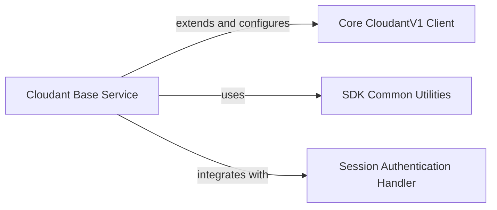

## Component Details

This graph illustrates the core components of the Cloudant client's foundational layer. The `Cloudant Base Service` acts as a central orchestrator, extending and configuring the `Core CloudantV1 Client` to enhance its capabilities. It integrates with the `Session Authentication Handler` for managing authenticated requests and utilizes `SDK Common Utilities` for generating standardized headers. The main flow involves the `Cloudant Base Service` intercepting and augmenting the behavior of the `Core CloudantV1 Client` for request preparation, default header settings, HTTP client configuration, and error response handling, ensuring robust and authenticated interactions with the Cloudant API.

### Cloudant Base Service
The foundational layer for the Cloudant client, handling generic service initialization, default header settings, HTTP client configuration, and the core logic for preparing and sending API requests. It also provides extended functionalities such as custom initialization, default header management, HTTP client configuration, session authentication handling, and custom error response hooks, effectively acting as a wrapper or patch over the core CloudantV1 client to enhance its behavior.

**Related Classes/Methods**:

- `ibmcloudant.cloudant_base_service` (full file reference)
- <a href="https://github.com/IBM/cloudant-python-sdk/blob/master/ibmcloudant/cloudant_base_service.py#L77-L89" target="_blank" rel="noopener noreferrer">`ibmcloudant.cloudant_base_service:new_init` (77:89)</a>
- <a href="https://github.com/IBM/cloudant-python-sdk/blob/master/ibmcloudant/cloudant_base_service.py#L103-L113" target="_blank" rel="noopener noreferrer">`ibmcloudant.cloudant_base_service:new_set_default_headers` (103:113)</a>
- <a href="https://github.com/IBM/cloudant-python-sdk/blob/master/ibmcloudant/cloudant_base_service.py#L238-L240" target="_blank" rel="noopener noreferrer">`ibmcloudant.cloudant_base_service:new_set_http_client` (238:240)</a>
- <a href="https://github.com/IBM/cloudant-python-sdk/blob/master/ibmcloudant/cloudant_base_service.py#L231-L234" target="_blank" rel="noopener noreferrer">`ibmcloudant.cloudant_base_service:add_hooks` (231:234)</a>
- <a href="https://github.com/IBM/cloudant-python-sdk/blob/master/ibmcloudant/cloudant_base_service.py#L125-L191" target="_blank" rel="noopener noreferrer">`ibmcloudant.cloudant_base_service:_error_response_hook` (125:191)</a>
- <a href="https://github.com/IBM/cloudant-python-sdk/blob/master/ibmcloudant/cloudant_base_service.py#L93-L99" target="_blank" rel="noopener noreferrer">`ibmcloudant.cloudant_base_service:new_set_service_url` (93:99)</a>
- <a href="https://github.com/IBM/cloudant-python-sdk/blob/master/ibmcloudant/cloudant_base_service.py#L120-L123" target="_blank" rel="noopener noreferrer">`ibmcloudant.cloudant_base_service:new_set_disable_ssl_verification` (120:123)</a>
- <a href="https://github.com/IBM/cloudant-python-sdk/blob/master/ibmcloudant/cloudant_base_service.py#L195-L229" target="_blank" rel="noopener noreferrer">`ibmcloudant.cloudant_base_service:new_prepare_request` (195:229)</a>

### Core CloudantV1 Client
This component represents the fundamental Cloudant V1 API client, offering the basic methods for interacting with the Cloudant database. It serves as the underlying service that is initialized and configured by the Cloudant Base Service, providing the core communication capabilities with the Cloudant API.

**Related Classes/Methods**:

- `ibmcloudant.cloudant_v1.CloudantV1` (full file reference)
- `ibmcloudant.cloudant_v1.CloudantV1.__init__` (full file reference)
- `ibmcloudant.cloudant_v1.CloudantV1.set_default_headers` (full file reference)
- `ibmcloudant.cloudant_v1.CloudantV1.set_http_client` (full file reference)
- `ibmcloudant.cloudant_v1.CloudantV1.set_service_url` (full file reference)
- `ibmcloudant.cloudant_v1.CloudantV1.set_disable_ssl_verification` (full file reference)
- `ibmcloudant.cloudant_v1.CloudantV1.prepare_request` (full file reference)

### SDK Common Utilities
This component provides shared utility functions for the SDK, primarily focused on generating standardized headers for API requests. These headers include crucial information like SDK analytics and user-agent details, which are used for client identification and usage tracking within the Cloudant ecosystem.

**Related Classes/Methods**:

- `ibmcloudant.common` (full file reference)
- <a href="https://github.com/IBM/cloudant-python-sdk/blob/master/ibmcloudant/common.py#L47-L51" target="_blank" rel="noopener noreferrer">`ibmcloudant.common.get_sdk_headers` (47:51)</a>

### Session Authentication Handler
This component manages the session-based authentication for Cloudant, including token management and authentication logic. It interacts with the Cloudant Base Service to provide authenticated requests.

**Related Classes/Methods**:

- <a href="https://github.com/IBM/cloudant-python-sdk/blob/master/ibmcloudant/couchdb_session_authenticator.py#L25-L93" target="_blank" rel="noopener noreferrer">`ibmcloudant.couchdb_session_authenticator.CouchDbSessionAuthenticator` (25:93)</a>
- <a href="https://github.com/IBM/cloudant-python-sdk/blob/master/ibmcloudant/couchdb_session_token_manager.py#L22-L104" target="_blank" rel="noopener noreferrer">`ibmcloudant.couchdb_session_token_manager.CouchDbSessionTokenManager` (22:104)</a>

### [FAQ](https://github.com/CodeBoarding/GeneratedOnBoardings/tree/main?tab=readme-ov-file#faq)