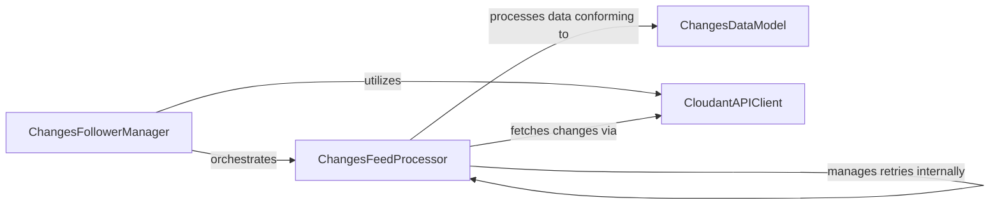

## Component Details

The Changes Feed Follower subsystem provides a robust and efficient mechanism for applications to track and process changes in a Cloudant database. It offers two primary modes of operation: one-off consumption of changes until no further pending changes exist, and continuous listening for new changes. The core functionality revolves around fetching changes from the Cloudant API, handling transient errors with exponential backoff and jitter, and providing an iterable interface for consuming the change items. The system ensures proper configuration validation and manages the lifecycle of the changes feed processing.

### ChangesFollowerManager
This component serves as the primary interface for users to interact with the Cloudant changes feed. It handles the initial setup, configuration validation (e.g., timeouts, invalid options), and orchestrates the start and stop operations for both one-off and continuous changes feed consumption. It instantiates and manages the lifecycle of the internal ChangesFeedProcessor.

**Related Classes/Methods**:

- <a href="https://github.com/IBM/cloudant-python-sdk/blob/master/ibmcloudant/features/changes_follower.py#L234-L465" target="_blank" rel="noopener noreferrer">`ibmcloudant.features.changes_follower.ChangesFollower` (234:465)</a>
- <a href="https://github.com/IBM/cloudant-python-sdk/blob/master/ibmcloudant/features/changes_follower.py#L291-L323" target="_blank" rel="noopener noreferrer">`ibmcloudant.features.changes_follower.ChangesFollower:__init__` (291:323)</a>
- <a href="https://github.com/IBM/cloudant-python-sdk/blob/master/ibmcloudant/features/changes_follower.py#L376-L399" target="_blank" rel="noopener noreferrer">`ibmcloudant.features.changes_follower.ChangesFollower:start` (376:399)</a>
- <a href="https://github.com/IBM/cloudant-python-sdk/blob/master/ibmcloudant/features/changes_follower.py#L401-L424" target="_blank" rel="noopener noreferrer">`ibmcloudant.features.changes_follower.ChangesFollower:start_one_off` (401:424)</a>
- <a href="https://github.com/IBM/cloudant-python-sdk/blob/master/ibmcloudant/features/changes_follower.py#L426-L433" target="_blank" rel="noopener noreferrer">`ibmcloudant.features.changes_follower.ChangesFollower:stop` (426:433)</a>
- <a href="https://github.com/IBM/cloudant-python-sdk/blob/master/ibmcloudant/features/changes_follower.py#L435-L465" target="_blank" rel="noopener noreferrer">`ibmcloudant.features.changes_follower.ChangesFollower:_run` (435:465)</a>
- <a href="https://github.com/IBM/cloudant-python-sdk/blob/master/ibmcloudant/features/changes_follower.py#L361-L374" target="_blank" rel="noopener noreferrer">`ibmcloudant.features.changes_follower.ChangesFollower:_set_defaults` (361:374)</a>

### ChangesFeedProcessor
This internal component is responsible for the core logic of fetching and processing changes from the Cloudant feed. It operates in a dedicated thread to perform long-polling requests, buffers the incoming change items, and implements a robust error handling and retry mechanism with exponential backoff and jitter for transient network issues. It also provides the iterator interface for consuming the changes.

**Related Classes/Methods**:

- <a href="https://github.com/IBM/cloudant-python-sdk/blob/master/ibmcloudant/features/changes_follower.py#L72-L231" target="_blank" rel="noopener noreferrer">`ibmcloudant.features.changes_follower._ChangesFollowerIterator` (72:231)</a>
- <a href="https://github.com/IBM/cloudant-python-sdk/blob/master/ibmcloudant/features/changes_follower.py#L88-L109" target="_blank" rel="noopener noreferrer">`ibmcloudant.features.changes_follower._ChangesFollowerIterator:__init__` (88:109)</a>
- <a href="https://github.com/IBM/cloudant-python-sdk/blob/master/ibmcloudant/features/changes_follower.py#L145-L165" target="_blank" rel="noopener noreferrer">`ibmcloudant.features.changes_follower._ChangesFollowerIterator:__next__` (145:165)</a>
- <a href="https://github.com/IBM/cloudant-python-sdk/blob/master/ibmcloudant/features/changes_follower.py#L167-L211" target="_blank" rel="noopener noreferrer">`ibmcloudant.features.changes_follower._ChangesFollowerIterator:_request_callback` (167:211)</a>
- <a href="https://github.com/IBM/cloudant-python-sdk/blob/master/ibmcloudant/features/changes_follower.py#L132-L140" target="_blank" rel="noopener noreferrer">`ibmcloudant.features.changes_follower._ChangesFollowerIterator.stop` (132:140)</a>
- <a href="https://github.com/IBM/cloudant-python-sdk/blob/master/ibmcloudant/features/changes_follower.py#L213-L231" target="_blank" rel="noopener noreferrer">`ibmcloudant.features.changes_follower._ChangesFollowerIterator.retry_delay` (213:231)</a>
- <a href="https://github.com/IBM/cloudant-python-sdk/blob/master/ibmcloudant/features/changes_follower.py#L129-L130" target="_blank" rel="noopener noreferrer">`ibmcloudant.features.changes_follower._ChangesFollowerIterator._start` (129:130)</a>
- <a href="https://github.com/IBM/cloudant-python-sdk/blob/master/ibmcloudant/features/changes_follower.py#L55-L60" target="_blank" rel="noopener noreferrer">`ibmcloudant.features.changes_follower._Mode` (55:60)</a>

### ChangesDataModel
This component defines the data structure for individual change items received from the Cloudant changes feed. It provides methods for deserializing raw dictionary responses into structured Python objects, making the change data easily accessible and usable within the application.

**Related Classes/Methods**:

- `ibmcloudant.cloudant_v1.ChangesResultItem` (full file reference)
- `ibmcloudant.cloudant_v1.ChangesResultItem.from_dict` (full file reference)

### CloudantAPIClient
This component provides the interface for interacting with the Cloudant database API, specifically for fetching changes feed data. It encapsulates the low-level HTTP requests and responses to the Cloudant service.

**Related Classes/Methods**:

- `ibmcloudant.cloudant_v1.CloudantV1` (full file reference)
- `ibmcloudant.cloudant_v1.CloudantV1:post_changes` (full file reference)

### [FAQ](https://github.com/CodeBoarding/GeneratedOnBoardings/tree/main?tab=readme-ov-file#faq)