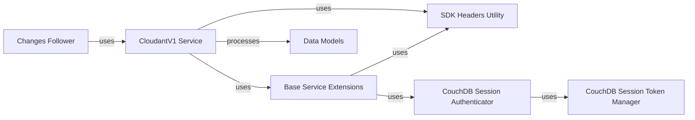

## Component Details

This graph represents the core components of the Cloudant API Client subsystem. The `CloudantV1 Service` acts as the central interface for all Cloudant operations, relying on `SDK Headers Utility` for request headers and `Base Service Extensions` for underlying HTTP client configurations and error handling. `Changes Follower` is used by the `CloudantV1 Service` to consume changes feeds. `Base Service Extensions` further utilizes `CouchDB Session Authenticator` for session-based authentication, which in turn depends on `CouchDB Session Token Manager` for token management. Various `Data Models` are processed by the `CloudantV1 Service` to structure data exchanged with the API.

### CloudantV1 Service
The core service client for interacting with the IBM Cloudant database service, providing methods for managing databases, documents, and other Cloudant resources. It serves as the main entry point for all Cloudant operations. It relies on `SDK Headers Utility` for setting up request headers and `Base Service Extensions` for underlying HTTP client configurations and error handling. It also uses `Changes Follower` for consuming the changes feed.

**Related Classes/Methods**:

- `ibmcloudant.cloudant_v1.CloudantV1` (full file reference)

### SDK Headers Utility
This component is responsible for generating standard SDK headers for API requests, including analytics and user agent information. It ensures that all requests made by the Cloudant SDK are properly identified and tracked.

**Related Classes/Methods**:

- <a href="https://github.com/IBM/cloudant-python-sdk/blob/master/ibmcloudant/common.py#L47-L51" target="_blank" rel="noopener noreferrer">`ibmcloudant.common.get_sdk_headers` (47:51)</a>

### Base Service Extensions
This module extends the base service functionality for the CloudantV1 client. It includes custom initialization, default header settings, SSL verification handling, and error response hooks. It also incorporates logic for handling session authentication with `CouchDbSessionAuthenticator` and validates path segments in request URLs.

**Related Classes/Methods**:

- `ibmcloudant.cloudant_base_service` (full file reference)

### Changes Follower
This component provides a helper for consuming the Cloudant changes feed. It supports both one-off fetching of changes and continuous listening for new changes. It includes logic for error tolerance, exponential backoff with jitter for transient errors, and manages an internal buffer for changes.

**Related Classes/Methods**:

- <a href="https://github.com/IBM/cloudant-python-sdk/blob/master/ibmcloudant/features/changes_follower.py#L72-L231" target="_blank" rel="noopener noreferrer">`ibmcloudant.features.changes_follower._ChangesFollowerIterator` (72:231)</a>
- <a href="https://github.com/IBM/cloudant-python-sdk/blob/master/ibmcloudant/features/changes_follower.py#L234-L465" target="_blank" rel="noopener noreferrer">`ibmcloudant.features.changes_follower.ChangesFollower` (234:465)</a>

### Data Models
This component encompasses various data models used throughout the Cloudant Python SDK, such as `ActiveTask`, `AllDocsResult`, `Document`, `DesignDocument`, `ReplicationDocument`, and `SchedulerJob`. These models facilitate the structured representation and manipulation of data exchanged with the Cloudant API.

**Related Classes/Methods**:

- `ibmcloudant.cloudant_v1.ActiveTask` (full file reference)
- `ibmcloudant.cloudant_v1.ActivityTrackerEvents` (full file reference)
- `ibmcloudant.cloudant_v1.AllDocsQueriesResult` (full file reference)
- `ibmcloudant.cloudant_v1.AllDocsQuery` (full file reference)
- `ibmcloudant.cloudant_v1.AllDocsResult` (full file reference)
- `ibmcloudant.cloudant_v1.Analyzer` (full file reference)
- `ibmcloudant.cloudant_v1.AnalyzerConfiguration` (full file reference)
- `ibmcloudant.cloudant_v1.ApiKeysResult` (full file reference)
- `ibmcloudant.cloudant_v1.Attachment` (full file reference)
- `ibmcloudant.cloudant_v1.BulkDocs` (full file reference)
- `ibmcloudant.cloudant_v1.BulkGetQueryDocument` (full file reference)
- `ibmcloudant.cloudant_v1.BulkGetResult` (full file reference)
- `ibmcloudant.cloudant_v1.BulkGetResultDocument` (full file reference)
- `ibmcloudant.cloudant_v1.BulkGetResultItem` (full file reference)
- `ibmcloudant.cloudant_v1.CapacityDatabasesInformation` (full file reference)
- `ibmcloudant.cloudant_v1.CapacityDatabasesInformationCurrent` (full file reference)
- `ibmcloudant.cloudant_v1.CapacityThroughputInformation` (full file reference)
- `ibmcloudant.cloudant_v1.CapacityThroughputInformationCurrent` (full file reference)
- `ibmcloudant.cloudant_v1.CapacityThroughputInformationTarget` (full file reference)
- `ibmcloudant.cloudant_v1.Change` (full file reference)
- `ibmcloudant.cloudant_v1.ChangesResult` (full file reference)
- `ibmcloudant.cloudant_v1.ChangesResultItem` (full file reference)
- `ibmcloudant.cloudant_v1.ContentInformationSizes` (full file reference)
- `ibmcloudant.cloudant_v1.CorsInformation` (full file reference)
- `ibmcloudant.cloudant_v1.CurrentDatabasesInformation` (full file reference)
- `ibmcloudant.cloudant_v1.CurrentThroughputInformation` (full file reference)
- `ibmcloudant.cloudant_v1.CurrentThroughputInformationThroughput` (full file reference)
- `ibmcloudant.cloudant_v1.DatabaseInformation` (full file reference)
- `ibmcloudant.cloudant_v1.DatabaseInformationCluster` (full file reference)
- `ibmcloudant.cloudant_v1.DatabaseInformationProps` (full file reference)
- `ibmcloudant.cloudant_v1.DatabasesCountInformation` (full file reference)
- `ibmcloudant.cloudant_v1.DbEvent` (full file reference)
- `ibmcloudant.cloudant_v1.DbUpdates` (full file reference)
- `ibmcloudant.cloudant_v1.DbsInfoResult` (full file reference)
- `ibmcloudant.cloudant_v1.DesignDocument` (full file reference)
- `ibmcloudant.cloudant_v1.DesignDocumentInformation` (full file reference)
- `ibmcloudant.cloudant_v1.DesignDocumentOptions` (full file reference)
- `ibmcloudant.cloudant_v1.DesignDocumentViewIndex` (full file reference)
- `ibmcloudant.cloudant_v1.DesignDocumentViewsMapReduce` (full file reference)
- `ibmcloudant.cloudant_v1.DocsResultRow` (full file reference)
- `ibmcloudant.cloudant_v1.DocsResultRowValue` (full file reference)
- `ibmcloudant.cloudant_v1.Document` (full file reference)
- `ibmcloudant.cloudant_v1.DocumentResult` (full file reference)
- `ibmcloudant.cloudant_v1.DocumentRevisionStatus` (full file reference)
- `ibmcloudant.cloudant_v1.DocumentShardInfo` (full file reference)
- `ibmcloudant.cloudant_v1.ExecutionStats` (full file reference)
- `ibmcloudant.cloudant_v1.ExplainResult` (full file reference)
- `ibmcloudant.cloudant_v1.ExplainResultMrArgs` (full file reference)
- `ibmcloudant.cloudant_v1.ExplainResultOpts` (full file reference)
- `ibmcloudant.cloudant_v1.FindResult` (full file reference)
- `ibmcloudant.cloudant_v1.IndexAnalysis` (full file reference)
- `ibmcloudant.cloudant_v1.IndexAnalysisExclusionReason` (full file reference)
- `ibmcloudant.cloudant_v1.IndexCandidate` (full file reference)
- `ibmcloudant.cloudant_v1.IndexDefinition` (full file reference)
- `ibmcloudant.cloudant_v1.IndexField` (full file reference)
- `ibmcloudant.cloudant_v1.IndexInformation` (full file reference)
- `ibmcloudant.cloudant_v1.IndexResult` (full file reference)
- `ibmcloudant.cloudant_v1.IndexTextOperatorDefaultField` (full file reference)
- `ibmcloudant.cloudant_v1.IndexesInformation` (full file reference)
- `ibmcloudant.cloudant_v1.MembershipInformation` (full file reference)
- `ibmcloudant.cloudant_v1.Ok` (full file reference)
- `ibmcloudant.cloudant_v1.PartitionInformation` (full file reference)
- `ibmcloudant.cloudant_v1.PartitionInformationIndexes` (full file reference)
- `ibmcloudant.cloudant_v1.PartitionInformationIndexesIndexes` (full file reference)
- `ibmcloudant.cloudant_v1.PartitionInformationSizes` (full file reference)
- `ibmcloudant.cloudant_v1.PartitionedIndexesDetailedInformation` (full file reference)
- `ibmcloudant.cloudant_v1.PartitionedIndexesInformation` (full file reference)
- `ibmcloudant.cloudant_v1.ReplicationCreateTargetParameters` (full file reference)
- `ibmcloudant.cloudant_v1.ReplicationDatabase` (full file reference)
- `ibmcloudant.cloudant_v1.ReplicationDatabaseAuth` (full file reference)
- `ibmcloudant.cloudant_v1.ReplicationDatabaseAuthBasic` (full file reference)
- `ibmcloudant.cloudant_v1.ReplicationDatabaseAuthIam` (full file reference)
- `ibmcloudant.cloudant_v1.ReplicationDocument` (full file reference)
- `ibmcloudant.cloudant_v1.Revisions` (full file reference)
- `ibmcloudant.cloudant_v1.RevsDiff` (full file reference)
- `ibmcloudant.cloudant_v1.SchedulerDocsResult` (full file reference)
- `ibmcloudant.cloudant_v1.SchedulerDocument` (full file reference)
- `ibmcloudant.cloudant_v1.SchedulerInfo` (full file reference)
- `ibmcloudant.cloudant_v1.SchedulerJob` (full file reference)
- `ibmcloudant.cloudant_v1.SchedulerJobEvent` (full file reference)
- `ibmcloudant.cloudant_v1.SchedulerJobsResult` (full file reference)
- `ibmcloudant.cloudant_v1.SearchAnalyzeResult` (full file reference)
- `ibmcloudant.cloudant_v1.SearchDiskSizeInformation` (full file reference)
- `ibmcloudant.cloudant_v1.SearchIndexDefinition` (full file reference)
- `ibmcloudant.cloudant_v1.SearchIndexDiskSize` (full file reference)
- `ibmcloudant.cloudant_v1.SearchIndexInfo` (full file reference)
- `ibmcloudant.cloudant_v1.SearchInfoResult` (full file reference)
- `ibmcloudant.cloudant_v1.SearchResult` (full file reference)
- `ibmcloudant.cloudant_v1.SearchResultProperties` (full file reference)
- `ibmcloudant.cloudant_v1.SearchResultRow` (full file reference)
- `ibmcloudant.cloudant_v1.Security` (full file reference)
- `ibmcloudant.cloudant_v1.SecurityObject` (full file reference)
- `ibmcloudant.cloudant_v1.SelectorHint` (full file reference)
- `ibmcloudant.cloudant_v1.ServerInformation` (full file reference)
- `ibmcloudant.cloudant_v1.ServerVendor` (full file reference)
- `ibmcloudant.cloudant_v1.SessionAuthentication` (full file reference)
- `ibmcloudant.cloudant_v1.SessionInformation` (full file reference)
- `ibmcloudant.cloudant_v1.ShardsInformation` (full file reference)
- `ibmcloudant.cloudant_v1.ThroughputInformation` (full file reference)
- `ibmcloudant.cloudant_v1.UpInformation` (full file reference)
- `ibmcloudant.cloudant_v1.UpdatesPending` (full file reference)
- `ibmcloudant.cloudant_v1.UserContext` (full file reference)
- `ibmcloudant.cloudant_v1.UuidsResult` (full file reference)
- `ibmcloudant.cloudant_v1.ViewQueriesResult` (full file reference)
- `ibmcloudant.cloudant_v1.ViewQuery` (full file reference)
- `ibmcloudant.cloudant_v1.ViewResult` (full file reference)
- `ibmcloudant.cloudant_v1.ViewResultRow` (full file reference)

### CouchDB Session Authenticator
This component handles session-based authentication with CouchDB, managing the authentication process and interacting with the `CouchDB Session Token Manager` to obtain and refresh session tokens.

**Related Classes/Methods**:

- <a href="https://github.com/IBM/cloudant-python-sdk/blob/master/ibmcloudant/couchdb_session_authenticator.py#L25-L93" target="_blank" rel="noopener noreferrer">`ibmcloudant.couchdb_session_authenticator.CouchDbSessionAuthenticator` (25:93)</a>

### CouchDB Session Token Manager
This component is responsible for managing and providing session tokens for CouchDB authentication. It likely handles the storage, retrieval, and refreshing of these tokens.

**Related Classes/Methods**:

- <a href="https://github.com/IBM/cloudant-python-sdk/blob/master/ibmcloudant/couchdb_session_token_manager.py#L22-L104" target="_blank" rel="noopener noreferrer">`ibmcloudant.couchdb_session_token_manager.CouchDbSessionTokenManager` (22:104)</a>

### [FAQ](https://github.com/CodeBoarding/GeneratedOnBoardings/tree/main?tab=readme-ov-file#faq)