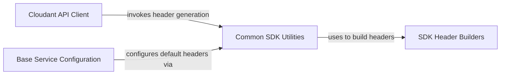

## Component Details

This architecture outlines the core components of the IBM Cloudant Python SDK, focusing on how API requests are structured and executed. The `Cloudant API Client` acts as the central interface for all database operations. It relies on the `Base Service Configuration` to establish foundational settings, including default headers. The `Common SDK Utilities` component is crucial for generating these standardized headers, which include SDK analytics and user-agent information, by leveraging the `SDK Header Builders` for specific header parts. This ensures consistent metadata across all API interactions, facilitating tracking and debugging.

### Cloudant API Client
This component serves as the primary interface for interacting with the IBM Cloudant database service. It encapsulates a wide range of API operations, including managing server information, databases, documents, design documents, indexes, replication, security, and attachments. Each method within this component corresponds to a specific Cloudant API endpoint, handling the request parameters, path construction, and response processing.

**Related Classes/Methods**:

- `cloudant-python-sdk.ibmcloudant.cloudant_v1.CloudantV1:get_server_information` (full file reference)
- `cloudant-python-sdk.ibmcloudant.cloudant_v1.CloudantV1:get_capacity_throughput_information` (full file reference)
- `cloudant-python-sdk.ibmcloudant.cloudant_v1.CloudantV1:put_capacity_throughput_configuration` (full file reference)
- `cloudant-python-sdk.ibmcloudant.cloudant_v1.CloudantV1:get_uuids` (full file reference)
- `cloudant-python-sdk.ibmcloudant.cloudant_v1.CloudantV1:get_db_updates` (full file reference)
- `cloudant-python-sdk.ibmcloudant.cloudant_v1.CloudantV1:post_changes` (full file reference)
- `cloudant-python-sdk.ibmcloudant.cloudant_v1.CloudantV1:post_changes_as_stream` (full file reference)
- `cloudant-python-sdk.ibmcloudant.cloudant_v1.CloudantV1:head_database` (full file reference)
- `cloudant-python-sdk.ibmcloudant.cloudant_v1.CloudantV1:get_all_dbs` (full file reference)
- `cloudant-python-sdk.ibmcloudant.cloudant_v1.CloudantV1:post_dbs_info` (full file reference)
- `cloudant-python-sdk.ibmcloudant.cloudant_v1.CloudantV1:delete_database` (full file reference)
- `cloudant-python-sdk.ibmcloudant.cloudant_v1.CloudantV1:get_database_information` (full file reference)
- `cloudant-python-sdk.ibmcloudant.cloudant_v1.CloudantV1:put_database` (full file reference)
- `cloudant-python-sdk.ibmcloudant.cloudant_v1.CloudantV1:head_document` (full file reference)
- `cloudant-python-sdk.ibmcloudant.cloudant_v1.CloudantV1:post_document` (full file reference)
- `cloudant-python-sdk.ibmcloudant.cloudant_v1.CloudantV1:post_all_docs` (full file reference)
- `cloudant-python-sdk.ibmcloudant.cloudant_v1.CloudantV1:post_all_docs_as_stream` (full file reference)
- `cloudant-python-sdk.ibmcloudant.cloudant_v1.CloudantV1:post_all_docs_queries` (full file reference)
- `cloudant-python-sdk.ibmcloudant.cloudant_v1.CloudantV1:post_all_docs_queries_as_stream` (full file reference)
- `cloudant-python-sdk.ibmcloudant.cloudant_v1.CloudantV1:post_bulk_docs` (full file reference)
- `cloudant-python-sdk.ibmcloudant.cloudant_v1.CloudantV1:post_bulk_get` (full file reference)
- `cloudant-python-sdk.ibmcloudant.cloudant_v1.CloudantV1:post_bulk_get_as_mixed` (full file reference)
- `cloudant-python-sdk.ibmcloudant.cloudant_v1.CloudantV1:post_bulk_get_as_related` (full file reference)
- `cloudant-python-sdk.ibmcloudant.cloudant_v1.CloudantV1:post_bulk_get_as_stream` (full file reference)
- `cloudant-python-sdk.ibmcloudant.cloudant_v1.CloudantV1:delete_document` (full file reference)
- `cloudant-python-sdk.ibmcloudant.cloudant_v1.CloudantV1:get_document` (full file reference)
- `cloudant-python-sdk.ibmcloudant.cloudant_v1.CloudantV1:get_document_as_mixed` (full file reference)
- `cloudant-python-sdk.ibmcloudant.cloudant_v1.CloudantV1:get_document_as_related` (full file reference)
- `cloudant-python-sdk.ibmcloudant.cloudant_v1.CloudantV1:get_document_as_stream` (full file reference)
- `cloudant-python-sdk.ibmcloudant.cloudant_v1.CloudantV1:put_document` (full file reference)
- `cloudant-python-sdk.ibmcloudant.cloudant_v1.CloudantV1:head_design_document` (full file reference)
- `cloudant-python-sdk.ibmcloudant.cloudant_v1.CloudantV1:delete_design_document` (full file reference)
- `cloudant-python-sdk.ibmcloudant.cloudant_v1.CloudantV1:get_design_document` (full file reference)
- `cloudant-python-sdk.ibmcloudant.cloudant_v1.CloudantV1:put_design_document` (full file reference)
- `cloudant-python-sdk.ibmcloudant.cloudant_v1.CloudantV1:get_design_document_information` (full file reference)
- `cloudant-python-sdk.ibmcloudant.cloudant_v1.CloudantV1:post_design_docs` (full file reference)
- `cloudant-python-sdk.ibmcloudant.cloudant_v1.CloudantV1:post_design_docs_queries` (full file reference)
- `cloudant-python-sdk.ibmcloudant.cloudant_v1.CloudantV1:post_view` (full file reference)
- `cloudant-python-sdk.ibmcloudant.cloudant_v1.CloudantV1:post_view_as_stream` (full file reference)
- `cloudant-python-sdk.ibmcloudant.cloudant_v1.CloudantV1:post_view_queries` (full file reference)
- `cloudant-python-sdk.ibmcloudant.cloudant_v1.CloudantV1:post_view_queries_as_stream` (full file reference)
- `cloudant-python-sdk.ibmcloudant.cloudant_v1.CloudantV1:get_partition_information` (full file reference)
- `cloudant-python-sdk.ibmcloudant.cloudant_v1.CloudantV1:post_partition_all_docs` (full file reference)
- `cloudant-python-sdk.ibmcloudant.cloudant_v1.CloudantV1:post_partition_all_docs_as_stream` (full file reference)
- `cloudant-python-sdk.ibmcloudant.cloudant_v1.CloudantV1:post_partition_search` (full file reference)
- `cloudant-python-sdk.ibmcloudant.cloudant_v1.CloudantV1:post_partition_search_as_stream` (full file reference)
- `cloudant-python-sdk.ibmcloudant.cloudant_v1.CloudantV1:post_partition_view` (full file reference)
- `cloudant-python-sdk.ibmcloudant.cloudant_v1.CloudantV1:post_partition_view_as_stream` (full file reference)
- `cloudant-python-sdk.ibmcloudant.cloudant_v1.CloudantV1:post_partition_explain` (full file reference)
- `cloudant-python-sdk.ibmcloudant.cloudant_v1.CloudantV1:post_partition_find` (full file reference)
- `cloudant-python-sdk.ibmcloudant.cloudant_v1.CloudantV1:post_partition_find_as_stream` (full file reference)
- `cloudant-python-sdk.ibmcloudant.cloudant_v1.CloudantV1:post_explain` (full file reference)
- `cloudant-python-sdk.ibmcloudant.cloudant_v1.CloudantV1:post_find` (full file reference)
- `cloudant-python-sdk.ibmcloudant.cloudant_v1.CloudantV1:post_find_as_stream` (full file reference)
- `cloudant-python-sdk.ibmcloudant.cloudant_v1.CloudantV1:get_indexes_information` (full file reference)
- `cloudant-python-sdk.ibmcloudant.cloudant_v1.CloudantV1:post_index` (full file reference)
- `cloudant-python-sdk.ibmcloudant.cloudant_v1.CloudantV1:delete_index` (full file reference)
- `cloudant-python-sdk.ibmcloudant.cloudant_v1.CloudantV1:post_search_analyze` (full file reference)
- `cloudant-python-sdk.ibmcloudant.cloudant_v1.CloudantV1:post_search` (full file reference)
- `cloudant-python-sdk.ibmcloudant.cloudant_v1.CloudantV1:post_search_as_stream` (full file reference)
- `cloudant-python-sdk.ibmcloudant.cloudant_v1.CloudantV1:get_search_disk_size` (full file reference)
- `cloudant-python-sdk.ibmcloudant.cloudant_v1.CloudantV1:get_search_info` (full file reference)
- `cloudant-python-sdk.ibmcloudant.cloudant_v1.CloudantV1:head_replication_document` (full file reference)
- `cloudant-python-sdk.ibmcloudant.cloudant_v1.CloudantV1:head_scheduler_document` (full file reference)
- `cloudant-python-sdk.ibmcloudant.cloudant_v1.CloudantV1:head_scheduler_job` (full file reference)
- `cloudant-python-sdk.ibmcloudant.cloudant_v1.CloudantV1:post_replicator` (full file reference)
- `cloudant-python-sdk.ibmcloudant.cloudant_v1.CloudantV1:delete_replication_document` (full file reference)
- `cloudant-python-sdk.ibmcloudant.cloudant_v1.CloudantV1:get_replication_document` (full file reference)
- `cloudant-python-sdk.ibmcloudant.cloudant_v1.CloudantV1:put_replication_document` (full file reference)
- `cloudant-python-sdk.ibmcloudant.cloudant_v1.CloudantV1:get_scheduler_docs` (full file reference)
- `cloudant-python-sdk.ibmcloudant.cloudant_v1.CloudantV1:get_scheduler_document` (full file reference)
- `cloudant-python-sdk.ibmcloudant.cloudant_v1.CloudantV1:get_scheduler_jobs` (full file reference)
- `cloudant-python-sdk.ibmcloudant.cloudant_v1.CloudantV1:get_scheduler_job` (full file reference)
- `cloudant-python-sdk.ibmcloudant.cloudant_v1.CloudantV1:get_session_information` (full file reference)
- `cloudant-python-sdk.ibmcloudant.cloudant_v1.CloudantV1:post_api_keys` (full file reference)
- `cloudant-python-sdk.ibmcloudant.cloudant_v1.CloudantV1:put_cloudant_security_configuration` (full file reference)
- `cloudant-python-sdk.ibmcloudant.cloudant_v1.CloudantV1:get_security` (full file reference)
- `cloudant-python-sdk.ibmcloudant.cloudant_v1.CloudantV1:put_security` (full file reference)
- `cloudant-python-sdk.ibmcloudant.cloudant_v1.CloudantV1:get_cors_information` (full file reference)
- `cloudant-python-sdk.ibmcloudant.cloudant_v1.CloudantV1:put_cors_configuration` (full file reference)
- `cloudant-python-sdk.ibmcloudant.cloudant_v1.CloudantV1:head_attachment` (full file reference)
- `cloudant-python-sdk.ibmcloudant.cloudant_v1.CloudantV1:delete_attachment` (full file reference)
- `cloudant-python-sdk.ibmcloudant.cloudant_v1.CloudantV1:get_attachment` (full file reference)
- `cloudant-python-sdk.ibmcloudant.cloudant_v1.CloudantV1:put_attachment` (full file reference)
- `cloudant-python-sdk.ibmcloudant.cloudant_v1.CloudantV1:head_local_document` (full file reference)
- `cloudant-python-sdk.ibmcloudant.cloudant_v1.CloudantV1:delete_local_document` (full file reference)
- `cloudant-python-sdk.ibmcloudant.cloudant_v1.CloudantV1:get_local_document` (full file reference)
- `cloudant-python-sdk.ibmcloudant.cloudant_v1.CloudantV1:put_local_document` (full file reference)
- `cloudant-python-sdk.ibmcloudant.cloudant_v1.CloudantV1:post_revs_diff` (full file reference)
- `cloudant-python-sdk.ibmcloudant.cloudant_v1.CloudantV1:get_shards_information` (full file reference)
- `cloudant-python-sdk.ibmcloudant.cloudant_v1.CloudantV1:get_document_shards_info` (full file reference)
- `cloudant-python-sdk.ibmcloudant.cloudant_v1.CloudantV1:head_up_information` (full file reference)
- `cloudant-python-sdk.ibmcloudant.cloudant_v1.CloudantV1:get_active_tasks` (full file reference)
- `cloudant-python-sdk.ibmcloudant.cloudant_v1.CloudantV1:get_activity_tracker_events` (full file reference)
- `cloudant-python-sdk.ibmcloudant.cloudant_v1.CloudantV1:post_activity_tracker_events` (full file reference)
- `cloudant-python-sdk.ibmcloudant.cloudant_v1.CloudantV1:get_capacity_databases_information` (full file reference)
- `cloudant-python-sdk.ibmcloudant.cloudant_v1.CloudantV1:get_current_databases_information` (full file reference)
- `cloudant-python-sdk.ibmcloudant.cloudant_v1.CloudantV1:get_current_throughput_information` (full file reference)
- `cloudant-python-sdk.ibmcloudant.cloudant_v1.CloudantV1:get_membership_information` (full file reference)
- `cloudant-python-sdk.ibmcloudant.cloudant_v1.CloudantV1:get_up_information` (full file reference)

### Common SDK Utilities
This component provides shared utility functions essential for the SDK's operation, primarily focusing on generating standardized HTTP headers for API requests. It ensures that all outgoing requests include necessary metadata such as SDK analytics and user-agent information, which are crucial for tracking and debugging.

**Related Classes/Methods**:

- <a href="https://github.com/IBM/cloudant-python-sdk/blob/master/ibmcloudant/common.py#L47-L51" target="_blank" rel="noopener noreferrer">`ibmcloudant.common.get_sdk_headers` (47:51)</a>

### SDK Header Builders
This component is responsible for constructing specific parts of the HTTP headers used by the SDK. It includes functions for generating the SDK analytics header, which provides details about the service, version, and operation, and the user-agent header, which identifies the client application and its environment.

**Related Classes/Methods**:

- <a href="https://github.com/IBM/cloudant-python-sdk/blob/master/ibmcloudant/common.py#L39-L41" target="_blank" rel="noopener noreferrer">`ibmcloudant.common.get_sdk_analytics` (39:41)</a>
- <a href="https://github.com/IBM/cloudant-python-sdk/blob/master/ibmcloudant/common.py#L35-L36" target="_blank" rel="noopener noreferrer">`ibmcloudant.common.get_user_agent` (35:36)</a>
- <a href="https://github.com/IBM/cloudant-python-sdk/blob/master/ibmcloudant/common.py#L27-L32" target="_blank" rel="noopener noreferrer">`ibmcloudant.common.get_system_info` (27:32)</a>
- <a href="https://github.com/IBM/cloudant-python-sdk/blob/master/ibmcloudant/common.py#L32-L32" target="_blank" rel="noopener noreferrer">`ibmcloudant.common.user_agent` (32:32)</a>

### Base Service Configuration
This component provides foundational service configuration and common request preparation logic for the Cloudant SDK. It includes methods for setting default headers that are applied across various API calls, ensuring consistency and adherence to SDK standards.

**Related Classes/Methods**:

- <a href="https://github.com/IBM/cloudant-python-sdk/blob/master/ibmcloudant/cloudant_base_service.py#L103-L113" target="_blank" rel="noopener noreferrer">`cloudant-python-sdk.ibmcloudant.cloudant_base_service:new_set_default_headers` (103:113)</a>

### [FAQ](https://github.com/CodeBoarding/GeneratedOnBoardings/tree/main?tab=readme-ov-file#faq)