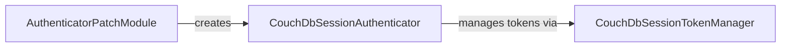

## Component Details

This subsystem provides CouchDB session-based authentication for API interactions. It includes a patching mechanism to integrate with the SDK's authenticator creation process, a dedicated authenticator that handles session token acquisition and management, and a token manager responsible for obtaining and refreshing these session tokens.

### AuthenticatorPatchModule
This module is responsible for patching the SDK core authenticator to support CouchDB session authentication. It intercepts the get_authenticator function and, if the authentication type is COUCHDB_SESSION, it returns a CouchDbSessionAuthenticator instance.

**Related Classes/Methods**:

- <a href="https://github.com/IBM/cloudant-python-sdk/blob/master/ibmcloudant/couchdb_session_get_authenticator_patch.py#L25-L41" target="_blank" rel="noopener noreferrer">`ibmcloudant.couchdb_session_get_authenticator_patch:new_construct_authenticator` (25:41)</a>

### CouchDbSessionAuthenticator
This component handles session authentication for CouchDB. It utilizes a username and password to obtain a session token and adds it to requests. It manages the session token through a CouchDbSessionTokenManager and validates the provided credentials.

**Related Classes/Methods**:

- <a href="https://github.com/IBM/cloudant-python-sdk/blob/master/ibmcloudant/couchdb_session_authenticator.py#L25-L93" target="_blank" rel="noopener noreferrer">`ibmcloudant.couchdb_session_authenticator.CouchDbSessionAuthenticator` (25:93)</a>
- <a href="https://github.com/IBM/cloudant-python-sdk/blob/master/ibmcloudant/couchdb_session_authenticator.py#L42-L56" target="_blank" rel="noopener noreferrer">`ibmcloudant.couchdb_session_authenticator.CouchDbSessionAuthenticator:__init__` (42:56)</a>
- <a href="https://github.com/IBM/cloudant-python-sdk/blob/master/ibmcloudant/couchdb_session_authenticator.py#L64-L75" target="_blank" rel="noopener noreferrer">`ibmcloudant.couchdb_session_authenticator.CouchDbSessionAuthenticator.validate` (64:75)</a>

### CouchDbSessionTokenManager
This component is responsible for obtaining and managing CouchDB session tokens. It takes a username and password, performs requests to the CouchDB service to get a session token, and handles token expiration and refreshing.

**Related Classes/Methods**:

- <a href="https://github.com/IBM/cloudant-python-sdk/blob/master/ibmcloudant/couchdb_session_token_manager.py#L22-L104" target="_blank" rel="noopener noreferrer">`ibmcloudant.couchdb_session_token_manager.CouchDbSessionTokenManager` (22:104)</a>

### [FAQ](https://github.com/CodeBoarding/GeneratedOnBoardings/tree/main?tab=readme-ov-file#faq)