```mermaid
graph LR
    Cloudant_API_Client["Cloudant API Client"]
    Common_SDK_Utilities["Common SDK Utilities"]
    Base_Service_Core["Base Service Core"]
    CouchDB_Session_Authentication["CouchDB Session Authentication"]
    Changes_Feed_Follower["Changes Feed Follower"]
    API_Data_Models["API Data Models"]
    Cloudant_API_Client -- "invokes" --> Common_SDK_Utilities
    Cloudant_API_Client -- "uses" --> API_Data_Models
    Base_Service_Core -- "initializes" --> Cloudant_API_Client
    Base_Service_Core -- "uses" --> Common_SDK_Utilities
    CouchDB_Session_Authentication -- "provides authenticator to" --> Base_Service_Core
    Changes_Feed_Follower -- "fetches changes via" --> Cloudant_API_Client
    Changes_Feed_Follower -- "processes data as" --> API_Data_Models
    click Cloudant_API_Client href "https://github.com/CodeBoarding/GeneratedOnBoardings/blob/main/cloudant-python-sdk/Cloudant API Client.md" "Details"
    click Common_SDK_Utilities href "https://github.com/CodeBoarding/GeneratedOnBoardings/blob/main/cloudant-python-sdk/Common SDK Utilities.md" "Details"
    click Base_Service_Core href "https://github.com/CodeBoarding/GeneratedOnBoardings/blob/main/cloudant-python-sdk/Base Service Core.md" "Details"
    click CouchDB_Session_Authentication href "https://github.com/CodeBoarding/GeneratedOnBoardings/blob/main/cloudant-python-sdk/CouchDB Session Authentication.md" "Details"
    click Changes_Feed_Follower href "https://github.com/CodeBoarding/GeneratedOnBoardings/blob/main/cloudant-python-sdk/Changes Feed Follower.md" "Details"
    click API_Data_Models href "https://github.com/CodeBoarding/GeneratedOnBoardings/blob/main/cloudant-python-sdk/API Data Models.md" "Details"
```

## Component Details

This architecture analysis describes the high-level data flow and component interactions within the `cloudant-python-sdk`. The SDK provides a robust interface for interacting with IBM Cloudant, managing database operations, handling authentication, and tracking real-time changes. The core flow involves the `Cloudant API Client` making requests, supported by the `Base Service Core` for underlying communication and authentication, utilizing `Common SDK Utilities` for shared functionalities, and processing data through `API Data Models`. Specialized features like the `Changes Feed Follower` extend the core capabilities.

### Cloudant API Client
The primary interface for interacting with the IBM Cloudant database service, providing methods for managing databases, documents, and other Cloudant resources. It serves as the main entry point for all Cloudant operations.

**Related Classes/Methods**:

- `ibmcloudant.cloudant_v1.CloudantV1` (full file reference)

### Common SDK Utilities
Provides shared utility functions for the SDK, primarily for generating standardized SDK headers and managing user agent strings, ensuring consistent metadata for API requests.

**Related Classes/Methods**:

- `ibmcloudant.common` (full file reference)

### Base Service Core
The foundational layer for the Cloudant client, handling generic service initialization, default header settings, HTTP client configuration, and the core logic for preparing and sending API requests.

**Related Classes/Methods**:

- `ibmcloudant.cloudant_base_service` (full file reference)

### CouchDB Session Authentication
Manages CouchDB session-based authentication, handling the construction of authenticators and the lifecycle of session tokens to secure API interactions.

**Related Classes/Methods**:

- <a href="https://github.com/IBM/cloudant-python-sdk/blob/master/ibmcloudant/couchdb_session_authenticator.py#L25-L93" target="_blank" rel="noopener noreferrer">`ibmcloudant.couchdb_session_authenticator.CouchDbSessionAuthenticator` (25:93)</a>
- <a href="https://github.com/IBM/cloudant-python-sdk/blob/master/ibmcloudant/couchdb_session_token_manager.py#L22-L104" target="_blank" rel="noopener noreferrer">`ibmcloudant.couchdb_session_token_manager.CouchDbSessionTokenManager` (22:104)</a>

### Changes Feed Follower
A specialized feature enabling applications to efficiently track and process changes in a Cloudant database by providing an iterator for consuming the changes feed.

**Related Classes/Methods**:

- <a href="https://github.com/IBM/cloudant-python-sdk/blob/master/ibmcloudant/features/changes_follower.py#L234-L465" target="_blank" rel="noopener noreferrer">`ibmcloudant.features.changes_follower.ChangesFollower` (234:465)</a>

### API Data Models
Defines the structure of data exchanged with the Cloudant API, facilitating the serialization of Python objects to JSON for requests and deserialization of JSON responses into Python objects.

**Related Classes/Methods**:

- `ibmcloudant.cloudant_v1.ActiveTask` (full file reference)
- `ibmcloudant.cloudant_v1.AllDocsResult` (full file reference)
- `ibmcloudant.cloudant_v1.Document` (full file reference)

### [FAQ](https://github.com/CodeBoarding/GeneratedOnBoardings/tree/main?tab=readme-ov-file#faq)